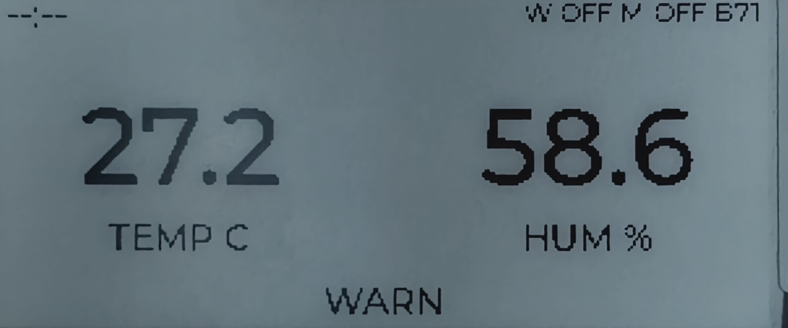

# ESP32-S3 墨水屏温湿度监测终端

这是我基于 **Heltec Vision Master E290** 做的一个温湿度监测终端固件。Vision Master E290 这块板子本身集成了 **ESP32-S3、SX1262 LoRa 和 E-Ink 墨水屏**，属于带 LoRa 能力的墨水屏节点硬件。

当前这版固件主要用到了 ESP32-S3、墨水屏、Wi-Fi、BLE、MQTT 和本地 Web 后台。板载 SX1262 LoRa 硬件暂未作为当前主要通信链路使用，本仓库也没有实现 Meshtastic 或 LoRaWAN。



## 已实现功能

- 墨水屏显示温度、湿度、电池、Wi-Fi/MQTT 状态和环境状态
- BLE 配网，屏幕显示 BLE 配网二维码
- Wi-Fi 连接后，按键显示 Web 后台二维码
- Wi-Fi 多 profile 保存、扫描和自动选择连接
- 本地 Web 后台
  - 状态看板
  - MQTT / 系统配置
  - 环境预设管理
  - 报警记录
  - 历史数据表
  - Canvas 历史趋势图
- MQTT telemetry/status 上报
- MQTT control/config 下发处理
- 环境预设 EnvProfile
- 温湿度 warning / alarm 判断
- RAM 报警事件记录
- RAM 历史数据缓存
- NTP 时间同步，中国时区显示
- 电池电压检测和校准系数配置

## 硬件平台

主板：Heltec Vision Master E290

板载硬件：

- ESP32-S3
- SX1262 LoRa
- E-Ink 墨水屏

外接或当前使用的硬件：

- DHT11 温湿度传感器
- 电池电压检测电路
- 一个按键，用于切换主页面、BLE 配网页和 Web 后台二维码页

当前固件使用情况：

- ESP32-S3：主控、Wi-Fi、BLE、WebServer、MQTT
- E-Ink：主界面和二维码显示
- DHT11：温湿度采集
- ADC：电池电压检测
- SX1262：硬件保留，当前固件暂未使用它作为主要通信链路

## 引脚

| 模块 | 引脚 / 说明 |
| --- | --- |
| DHT11 | `GPIO39` |
| 按键 | `GPIO17`，按键接 `GPIO17` 与 `GND`，代码使用 `INPUT_PULLUP` |
| 电池 ADC 输入 | `GPIO7` |
| 电池 ADC 使能 | `GPIO46` |
| 墨水屏 | `EInkDisplay_VisionMasterE290`，由 `heltec-eink-modules` 封装 |

墨水屏 SPI 和控制引脚由 Heltec 库封装，业务代码里没有单独写这些引脚。

## 软件环境

- VSCode
- PlatformIO
- Arduino framework
- LVGL 8.3.11

主要依赖库：

- `heltec-eink-modules`
- `lvgl@8.3.11`
- `DHT sensor library`
- `WiFiManager`
- `PubSubClient`
- `QRCode`
- `NTPClient`

## 编译和烧录

```bash
pio run --environment vision-master-e290
pio run -t upload --environment vision-master-e290
pio device monitor --environment vision-master-e290
```

Windows 下如果 `pio` 不在 PATH 中，可以直接使用 PlatformIO 虚拟环境里的 `platformio.exe`。

## 使用流程

1. 设备上电后进入墨水屏主界面。
2. 未配置 Wi-Fi 时，设备会在后台准备 BLE 配网。
3. 按下 `GPIO17` 按键，屏幕显示 BLE 配网二维码。
4. 使用 ESP BLE Prov App 扫码并写入 Wi-Fi 信息。
5. Wi-Fi 连接成功后，本地 Web 后台启动。
6. 再次按键，屏幕显示 Web 后台二维码。
7. 浏览器进入 Web 后台后，可以配置 MQTT、查看状态、管理环境预设、查看报警记录和历史数据。

当前 BLE PoP 默认是 `12345678`，只作为调试默认值。

## MQTT

默认 topic prefix：

```text
devices/<device_id>
```

主要 topic：

```text
devices/<device_id>/telemetry
devices/<device_id>/status
devices/<device_id>/control/set
devices/<device_id>/control/report
devices/<device_id>/config/set
devices/<device_id>/config/report
```

常用命令：

```json
{"cmd":"ping"}
```

```json
{"cmd":"report_status"}
```

```json
{"cmd":"report_now"}
```

```json
{"cmd":"report_alarms"}
```

```json
{"cmd":"ack_alarm","id":3}
```

```json
{"cmd":"report_history","limit":20}
```

配置示例：

```json
{
  "sensor_sample_interval_ms": 10000,
  "report_interval_ms": 60000,
  "display_refresh_interval_ms": 50000
}
```

更多 payload 见 [docs/examples/mqtt_payloads.md](docs/examples/mqtt_payloads.md)。

## Web API

主要接口：

- `GET /`
- `GET /api/status`
- `GET /api/history`
- `GET /api/alarms`
- `POST /api/alarms/ack`
- `POST /api/alarms/ack-all`
- `GET /api/env/profiles`
- `POST /api/env/profile/save`
- `POST /api/env/profile/select`
- `POST /api/env/profile/delete`
- `GET /api/wifi/profiles`
- `POST /api/wifi/profile/save`
- `POST /api/wifi/profile/delete`
- `POST /api/wifi/reconnect`
- `POST /save-mqtt`

接口字段见 [docs/api.md](docs/api.md)。

## 项目结构

```text
.
├── platformio.ini
├── src/
│   ├── main.cpp
│   ├── ui_manager.*
│   ├── network_manager.*
│   ├── provisioning_manager.*
│   ├── web_config_server.*
│   ├── config_manager.*
│   ├── wifi_profile_manager.*
│   ├── environment_monitor.*
│   ├── alarm_manager.*
│   ├── history_manager.*
│   ├── battery_manager.*
│   └── app_state.*
├── include/
│   ├── lv_conf.h
│   └── lvgl_eink_bridge.h
├── docs/
├── assets/screenshots/
└── README.md
```

## 当前限制

- SX1262 LoRa 暂未接入当前主要通信流程。
- 没有实现 Meshtastic 或 LoRaWAN。
- 报警事件和历史数据保存在 RAM，重启后会丢失。
- 本地 Web 后台只适合同一局域网维护，不建议暴露到公网。
- mDNS 在部分手机热点、校园网或路由器环境下不稳定，二维码优先使用 IP URL。
- DHT11 精度和采样频率有限，代码里做了安全采样间隔限制。
- 墨水屏不适合高频刷新，当前 UI 尽量避免频繁全屏刷新。

## 后续开发

后续开发计划见 [TODO.md](TODO.md)。

## 许可证

当前仓库暂未指定开源许可证。
